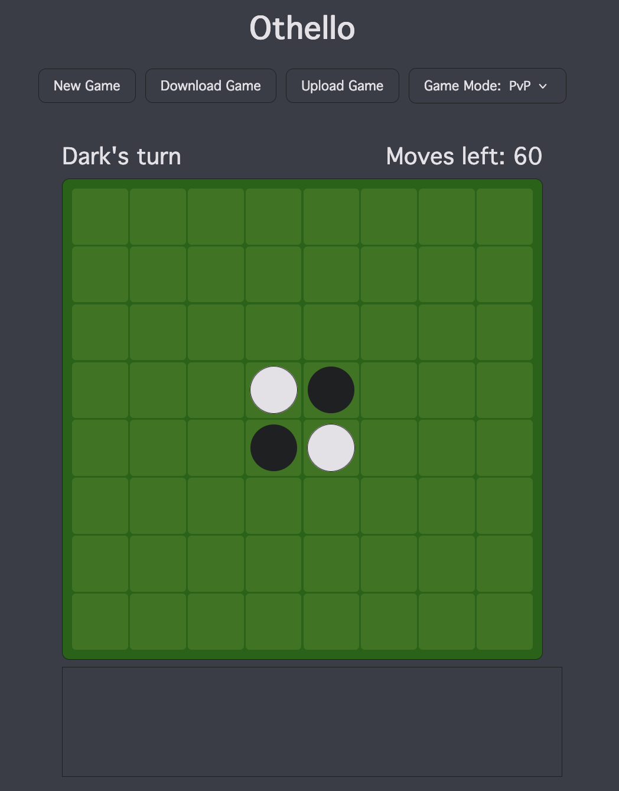
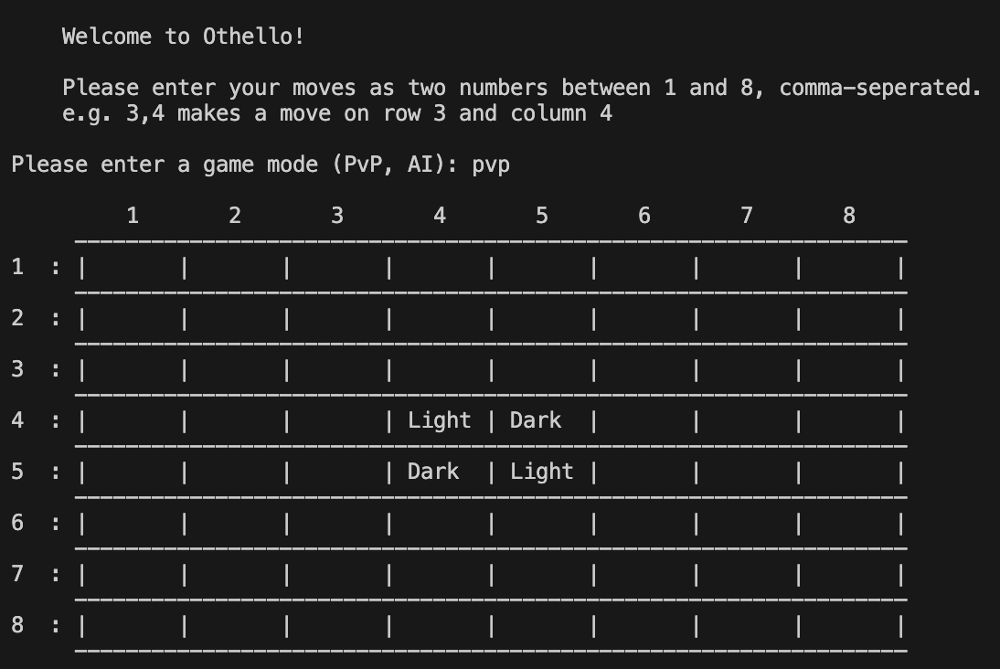

# Othello

Coursework 2 for ECM1400  
Author: Alex Garrison  
Licence: [MIT](LICENSE.md). Auto-generated by GitHub.

This coursework is an implementation of Othello for both the console, and the web.
It allows for playing against another player locally, or against an AI opponent.

The repository is hosted [here](https://github.com/alex-garrison-uni/othello).

<table>
    <tr>
    <td></td>
    <td></td>
    <tr>
</table>

There is a minor instance where I have not adhered fully to the coursework brief. The cell values are stored as:

``` python
"Dark" instead of "Dark "
None instead of "None "
```

This is because it is more efficient to pad the cell value when printing, rather than actually storing the padded characters.
Additionally, storing an empty value as `"None "` is not Pythonic and would make checking for empty cells more complicated.

[User Manual](manual.md)

## Technical Breakdown

### Project Structure

    .
    ├── .gitignore
    ├── .pre-commit-config.yaml
    ├── README.md
    ├── LICENSE.md
    ├── images
    │   ├── screenshots/
    |   |   └── ...
    │   └── diagrams/
    |       └── ...
    ├── manual.doc
    ├── pyproject.toml
    ├── requirements.txt
    ├── src
    │   └── othello
    │       ├── __init__.py
    │       ├── ai.py
    │       ├── components.py
    │       ├── flask_game_engine.py
    │       └── game_engine.py
    ├── templates
    │   └── index.html
    ├── tests
    │   ├── test_ai.py
    │   ├── test_components.py
    │   ├── test_game_engine.py
    │   └── testing_utils.py
    └── uv.lock

#### Code files

- The Python code is contained within a module: `Othello`.
- The `index.html` file used by Flask is contained within `templates`.

#### Documentation files

- `README.md` contains a technical breakdown of the project.
- `manual.doc` contains a user’s manual to the project.
- `diagrams/algorithm_flowcharts.drawio` contains the diagrams for important algorithms.
- `images/diagrams` contains the images of each of these diagrams, as well as the `.drawio` file for the diagrams.
- `images/screenshots` contains screenshots of the web app.

#### Test files

- All test files are stored under `tests`.
- There is a `testing_utils.py` file that provides utilities for testing.
- More information can be found in [Testing](#testing).

#### Other files

- Python package metadata is contained within `pyproject.toml`.
- `LICENCE.md` contains the project’s license
- `uv.lock` is the lockfile for the `uv` package manager.
- `requirements.txt` contains a `pip`-installable list of required packages.
- `.gitignore` contains a list of directories and files not to be tracked by `git`.

### Code

#### Modules

These are the non-testing code modules.

| **Module** | **Explanation** |
|----|----|
| `ai.py`<br>[Explanation](#ai) | Contains functions to generate pseudo-optimal moves. |
| `components.py`<br>[Explanation](#components) | Contains all the core functions to generate and interact with game boards. |
| `flask_game_engine.py`<br>[Explanation](#flask-game-engine) | Contains Flask code to form a backend for the Othello web app. Mixture of route functions, logging code and a class to contain the game state information. |
| `game_engine.py`<br>[Explanation](#game-engine) | Contains functions to interact with players via the console, and run a Othello game loop in both PvP and AI modes. Also contains a purely AI game loop for testing purposes. |

##### AI

| **Function** | **Summary** | **Flowchart/Explanation** |
|----|----|----|
| `get_random_move` | Generates a random move for a given board and colour. | Selects a random move from `get_legal_moves`. |
| `get_ai_move`<br>**Main AI function**. | Generates an optimal AI move for a given board and colour. |  |
| `score_board` | Return a heuristic score for a given board and colour.<br><br>Evaluates both mobility (total open moves) and board positioning.<br><br>Has weights for all mobility and board positioning. | Applies pre-defined weights to the metrics from `get_board_position_metrics`. |
| `get_potential_board_states` | Returns a mapping of potential moves to board states from a given board state, for a given colour. |  |
| `get_board_position_metrics` | Returns metrics about the count of cells positioned around the board, by colour.<br><br>Counts the number of each cell for:<br>- Corner / Corner adjacent / Corner double adjacent<br>- Edge / Edge adjacent / Edge double adjacent |  |

##### Components

| **Function** | **Summary** | **Flowchart/Explanation** |
|----|----|----|
| `initialise_board`<br> | Returns an initialised Othello board with the starting arrangement. | Generates a 2D array, and dynamically calculates and fills out the starting arrangement from the board size. |
| `print_board` | Prints a representation of the Othello board, with row and column labels for easier move identification. | Prints out the board row by row, with 1-based labels for the rows and columns, for easier move making. |
| `invert_player_colour` | Returns the opposite colour.<br><br>e.g. Light -\> Dark, Dark -\> Light |  |
| `legal_move` | Returns if a move is legal for a colour on a given Othello board. |  |
| `make_move` | Makes a given move on the board. |  |
| `count_cells_for_colour` | Return a mapping of player colours to the amount of cells they have on a given board. | Iterates through the board arrays, and counts the number of each of the cells. |
| `find_winner` | Return the winner for a given board.<br> | Uses `count_cells_for_colour` to find which player has more cells, if it is equal then it is a draw. |
| `get_legal_moves` | Returns a list of legal moves for a given board and colour. |  |
| `player_can_move` | Returns if a given player colour can move for a given board. | Checks if the list of legal moves from `get_legal_moves` is greater than zero. |

##### Flask Game Engine

| **Function/Class** | **Summary** | **Flowchart/Explanation** |
|----|----|----|
| `GameState` | Class to contain information about the current game state.<br>It is needed so that all the route functions have reference to the current game state, and it allows for new games to easily be started.<br> | Includes:<br>- The board<br>- The current player colour (which colour’s turn it is)<br>- How many moves are left in the game<br>- If the game is finished<br>- The game mode (Pv |
| `GameState.__init__` | Initialise the game state for a given game mode (PvP or AI). |  |
| `GameState.create_response` | Create a response to send to the front-end, with a given status and optional message.<br><br>Allows a game state to easily be sent to the front-end in a consistent format. | Returns a dictionary of the `GameState` values, and two extra values for `messag                                                                                                                                                                                                                                                                                                                                                               | |`GameState.update`| Update GameState values in place with given values.<br><br>Allows uploaded JSON to easily be imported into the current game state.                                                                                                                                | Iterates over the uploaded dictionary, setting the`GameState`variables t                                                                                                                                                                                                                                                                                                                                                                     | |`index`<br>Route =`/`| Render the website, with a new PvP game by default.                                                                                                                                                                                                               | Responds with the HTML and initialises a new`Gam |
| `new_game`<br>Route = `/newgame`<br>Arguments = `game_mode` | Begins a new game, using the game mode argument. | Initialises a new `GameState` on the back-end with the provided game mode and sends a response.<br><br>Checks |
| `download_game`<br>Route = `/download` | Returns the game state as a JSON file to be downloaded by the browser.<br><br> | Uses the builtin `__dict__` function of `GameState` to return the object as a dictionary, which is then serialised into JSON.<br><br>Uses a temporary file to s |
| `upload_game`<br>Route = `/upload`<br>Files = `game_file` | Updates the game state with an uploaded game state file. | Uses an uploaded JSON file, and parses it as a dictionary. Then uses the `update` method of the `G                                                                                                                                                                                                                                                                                                                                             | |`move`<br>Route =`/move`<br>Arguments =`x`,`y`| Makes a move on the board and check for a finished game. If is is the AI game mode, also makes an AI move.<br><br>Similar to the`simple_game_loop\`, it checks that the game has not ended after every mode. It also skips First checks that the game is not finished, sending a failure response if it is.<br><br>Then validates and makes the move, reducing the move count and checking whether to skip the opponent’s turn or not.<br><br>If it is an AI game, it will also make an AI move if available.<br><br>Checks if the game is won or not. Send a response with the new game state. Messages could include if turns are skipped, or the winner of a game. n or not, vailable. will also will also |

##### Game Engine

| **Function** | **Explantation** | **Flowchart** (if needed) |
|----|----|----|
| `parse_coords_input`<br> | Parses and returns user input board coordinates.<br><br>In case of any errors with the user input, it raises the corresponding error. | Strips the whitespace from the input string, and splits it using a comma delimiter.<br><br>Checks that only two values are in the split list.<br><br>Checks that the values are integers and within the board bounds. If this is all valid, return the coordinates as a tuple pair. |
| `cli_coords_input` | Prompts the user to input valid board coordinates.<br><br> | If there is any issue parsing the input coordinates (checked with`parse_coords_input`), it will continually re-prompt the user for a valid input. |
| `game_mode_input` | Prompts user to input a valid game mode. | Similarly to `cli_coords_input`, it continually re-prompts the user until they input either PvP or AI. |
| `simple_game_loop`<br>**Main game engine function**. | The main CLI game loop.<br><br>After one completed game it will exit. |  |
| `ai_game_loop` | Begin the AI game loop and return the winner. | Operates similarly to `simple_game_loop`, but allows for either an AI versus another AI, or an AI versus a random AI. <br><br>This is currently used for testing how well the AI performs against a random opponent. |

#### Linting

- The `ruff` linter is used to ensure code formatting.
- `ruff` is used in place of `pylint` for linting as it allows for a more definable ruleset.
- The tests are not linted.
- Linting rules are configured in `pyproject.toml`.

**Linting rules used**

| Ruff rule(s) | Function |
|----|----|
| `W`, `E` | Enforces PEP8 (general formatting) |
| `D` | Enforces PEP257 (docstrings) |
| `F` | Enforces Pyflakes (checks for code errors) |
| `N` | Enforces PEP8 (naming conventions) |
| `ANN` | Enforces PEP3107-style (type annotation)<br><br>Type annotations are only required for functions. |
| `LOG` | Enforces flake8-logging (logging conventions) |
| `PT` | Enforces flake8-pytest-style (pytest conventions) |
| `UP` | Enforces pyupgrade (modern python standards) |

#### Type Checking

- The `ty` type checker is used to avoid runtime type errors.
- Per [Linting](#linting) rule family `ANN`, types are required for all function arguments and returns.
- Variable type hints are omitted where they are implicit, but specified is not.
- The tests are not type-checked or type-annotated.

#### Logging

- Logging is used just for the web version of Othello, as having console logging would impact the user experience of the console version.
- All logging is done via the builtin `logging` library.
- The web app logging is used in conjunction with the native Flask logger.
- The logging is done at either the `INFO` or `ERROR` levels.

### Testing

- All testing is done via `pytest`.
- Parameterisation is used when appropriate to add more test cases.
- For `test_flask_game_engine` the Flask route functions are not tested directly.
- For `test_game_engine` the game loop itself is not tested due to the amount of user input. However, all of the functions it relies upon are tested.
- For `test_ai` the AI is not tested via selecting pre-defined optimal moves, but instead it’s outperformance of a random opponent.

#### Tests

| **Test** | **Coverage** | **Pytest file** |
|----|----|----|
| `test_board_initialisation` | Checks board initialisation and starting piece placement for different valid board sizes. | `test_components` |
| `test_zero_board_size_error` | Error raised for initialising board size of 0. | `test_components` |
| `test_odd_board_size_error` | Error raised for initialising an odd board size. | `test_components` |
| `test_legal_starting_moves` | Checks that move legality is correctly determined, for a starting board. | `test_components` |
| `test_legal_move_on_blocked_cell` | Checks that moves are not legal for moving on a blocked cell. | `test_components` |
| `test_make_starting_moves` | Checks that moves are made correctly (including flipping captured cells), for a starting board.<br><br>Covers move making on the horizontal and vertical axes. | `test_components` |
| `test_make_move` | Checks that moves are made correctly, for a developed board.<br><br>Covers move making on the horizontal, vertical and diagonal axes. Moves flip cells on multiple axes simultaneously. | `test_components` |
| `test_invalid_move_error` | Error raised for making illegal moves, on a starting board. | `test_components` |
| `test_find_winner` | Checks that the winner, or a draw, is correctly determined for pre-generated boards. | `test_components` |
| `test_coords_input` | Checks that valid coordinates are correctly parsed. | `test_game_engine` |
| `test_coords_input_error` | Errors raised for invalid coordinate strings. | `test_game_engine` |
| `test_game_state_initialises_defaults` | Checks that the GameState is initialised correctly for given game modes. | `test_flask_game_engine` |
| `test_update_overrides_state_values` | Checks that GameStates are correctly updated for new data. | `test_flask_game_engine` |
| `test_create_response_includes_current_state` | Checks that GameState responses are generated correctly. | `test_flask_game_engine` |
| `test_ai_outperforms_random_moves` | Checks that the AI will outperform a random opponent at a statistically significant level. | `test_ai` |

#### Testing Utilities

| **Function** | **Explantation** |
|----|----|
| `get_board_with_assignments` | Generates a board from a starting board given cell assignments.<br><br>Allows for easier generation of boards without having to make moves. |
| `get_board_by_type` | Generates 3 types of boards, used for testing.<br><br>`full_dark`: All cells are Dark<br>`full_light`: All cells are Light<br>`half_dark_half_light`: The top half cells are Dark, and the bottom half are Light |

### Miscellaneous

#### Pre-commit hooks

- To ensure that faulty code is not committed, pre-commit hooks are used.
- In `.pre-commit-config.yaml`, pre-commit hooks are used with `uv`, `ruff`, `ty` and `pytest`.
- Before committing, all code is tested, linted and type-checked.
- Additionally, the `uv` pre-commit hook updates the lockfile and auto-generates a `requirements.txt`.
